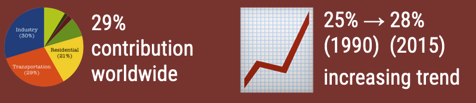
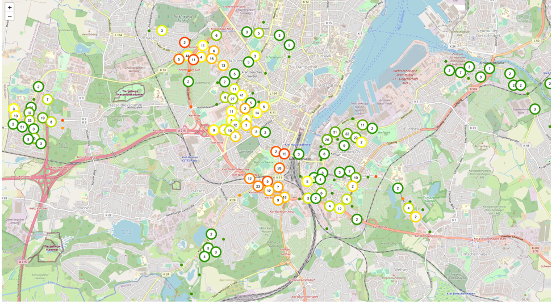

# ODALA Mobility Data Toolkit


## 1. Overview and Components

The goal of the ODALA Mobility Data Toolkit (MDT) is to utilize multiple
available data sources to estimate real-time CO2 mobility footprints in form of
a "Green Transport Twin" for a city. Understanding CO2 footprints of cities
transportation networks is crucial to enable a green transformation of Europe as it
helps city legislators to take actions to reduce CO2 footprint and track
progress through time.

  
*Figure 1. Worldwide emissions and emission trends from transportation sector. Transportation is one of the main drivers of emissions in the world.*


The ODALA Mobility Data Toolkit consists of multiple loosely coupled components
(see also Figure 2 below).


*Figure 2. Mobility Data Toolkit Components*

1. **The NREL OpenPath framework (https://www.nrel.gov/transportation/openpath.html):** To collect
   individual mobility traces directly from a smartphone application installed on the
   end user devices of the citizens. The open-source framework is maintained by
   the National Renewable Research Laboratory (NREL) with contributions by NEC:

   - **OpenPath NGSI-LD Adapter:** An adapter developed by NEC in ODALA to push data from
       the OpenPath ecosystem to an NGSI-LD context broker. To represent the
       detailed timeseries data from OpenPath, we designed a new NGSI-LD entity
       type named named *SectionObserved* that represents user sections from
       OpenPath (i.e., a timeseries of coordinates that represents a section of a
       user trip, e.g., a person taking a bus ride or drive in a car). In
       *SectionObserved* we abstract such section to a simple GEOJson linestring,
       which we obfuscate by changing the real start and end of the section is
       randomly. This allows the sharing of such data, e.g., as open data, without
       intruding into individuals privacy.

2. **NGSI-LD Context Broker:** An NGSI-LD compliant context broker is needed to
   let all components exchange data in NGSI-LD. We are using the open source
   Scorpio broker (https://github.com/ScorpioBroker) that is maintained by NEC.


3. **Green Transport Twin:** The Green Transport Twin (GTT) has the goal to
   estimate the current CO2 footprint (Emission). GTT queries data from the
   NGSI-LD context broker (TrafficFlowObserved, Vehicle and SectionObserved data types). For each
   observed TrafficFlowObserved/Vehicle, it then uses close-by SectionObserved data if available
   to estimate the approximate length of this specific TrafficFlowObserved/Vehicle observation. Recall that
   TrafficFlowObserved/Vehicle data is obtained from fixed sensors in the city (e.g., magnetic loop
   sensors, cameras, bicycle counters) and therefore cannot tell alone how long
   the associated section/trip of an observation has been. E.g., if we observe
   a car passing by, we do not know only from this observation of the car trip
   has been 5km or 50km. However, this length is crucial for CO2 estimation.
   Therefore we use the available SectionObserved data from OpenPath to
   estimate the length of each TrafficFlowObserved/Vehicle observation. After we estimate the
   length, we then calculate the CO2 footprint/emission using the
   [transport-co2 library](https://pypi.org/project/transport-co2/). This
   estimation is based on numbers provided by the European Environment Agency
   (EEA) which provides CO2 per km numbers for different transport modes [on
   their
   website](https://www.eea.europa.eu/media/infographics/co2-emissions-from-passenger-transport/view).
   We then push the estimated CO2 data to the NGSI-LD context broker using the
   newly defined EmissionObserved data model.
   - **Vehicle Simulator (optional):** We also developed a simple simulator to
   generate data of the [FIWARE Vehicle
   Type](https://github.com/FIWARE/data-models/blob/master/specs/Transportation/Vehicle/Vehicle/doc/spec.md).
   This simulator allows the user to configure sensing points in arbitrary
   places in the city and then uses a simple traffic model together with data
   queried from OpenStreetMap to simulate sensed vehicles (e.g., cars, trucks,
   bicycles...). Note that in an actual deployment, this simulator is not
   needed, but deployment cities of the mobility data toolkit need simply to
   push data of type *TrafficFlowObserved* or *Vehicle* to their NGSI-LD
   context broker. Dependent on the city, this data can come from various
   sensors such as magnetic loop sensors, traffic cameras, bicycle counters or
   even manual traffic counting.

4. **NGSI-LD adapters:** These adapters map and transform data to NGSI-LD in the
   Vehicle and TrafficFlowObserved data models:   
    - from [MDM](https://www.mdm-portal.de), the German National Access Point
      for Mobility Data (mdm_adapter).
    - from a NGSIv2 endpoint (ngsiv2_adapter)

6. **Dash Dashboard:** To visualize the mobility data and the CO2 emissions, we employ
   [Dash](https://github.com/plotly/dash). We developed an NGSI-LD plugin that
   enables Dash to directly consume data from an NGSI-LD broker. See Figure 2
   for an example visualisation of the ODALA deployment in Kiel.
   
   *Figure 2. Mobility Data Dashboard*


## 2. Setup

### Manual Installation

1. Install and deploy OpenPath. See [OpenPath
   instructions](https://github.com/e-mission/e-mission-server#deployment) for
   detailed steps. Docker container is available. Note that the Mobility Data
   Toolkit will still work without this step, but the estimation of lengths of
   Vehicle observations is only roughly estimated by putting a normal
   distribution around average length trips for different transport modes.

2. Install and deploy an NGSI-LD context broker. E.g., follow the instructions
   for Scorpio
   [here](https://github.com/ScorpioBroker/ScorpioBroker#installation-and-building).
   Docker container is available.

3. Push Vehicle or TrafficFlowObserved data to the NGSI-LD context broker or
   try our the traffic simulation included in the Green Digital Twin to
   simulate data. Note: For MDM data or NGSIv2 data you can simply use the
   adapters available in this repository. If OpenPath is deployed, start the
   NGSI-LD adapter that takes data from OpenPath and continuously publishes it
   as SectionObserved entities in the context broker.

4. Start the Green Transport Twin, e.g., by using docker or by manually
   starting the python script.

5. Start the Dash ngsildmap script and observe the CO2 data in the dashbaord :-)


### Installation using docker-compose

We also provide a docker-compose file that will fetch and start all the
necessary components automatically. Please note that this still requires the following manual steps:
- set the necessary configuration for OpenPath (see OpenPath documentation for
that)
- setup your existing sensing infrastructure to push data as [Vehicle type](https://github.com/FIWARE/data-models/blob/master/specs/Transportation/Vehicle/Vehicle/doc/spec.md)) to the NGSI-LD broker.


## Demo/Experimental Testbed

tbd

## Appendix: Data Models

The mobility data toolkit relies on the following data models:

- [Vehicle](https://github.com/FIWARE/data-models/blob/master/specs/Transportation/Vehicle/Vehicle/doc/spec.md)
- SectionObserved
- EmissionObserved

We are working on further refining SectionObserved and EmissionObserved so they
can become part of the official FIWARE smart data catalogue.

See below for example instantiations of these data models.


```python
ngsi_template_vehicle = {
    "id": "urn:ngsi-ld:Vehicle:vehicle1",
    "type": "Vehicle",
    "vehicleType": {"type": "Property", "value": "car"},
    "description": {"type": "Property", "value": "camera1"},
    "location": {
        "type": "GeoProperty",
        "value": {
            "type": "Point",
            "coordinates": [-3.164485591715449, 40.62785133667262],
        },
        "observedAt": "2018-09-27T12:00:00Z",
    },
    "speed": {"type": "Property", "value": 50, "observedAt": "2018-09-27T12:00:00Z"},
    "heading": {"type": "Property", "value": 180, "observedAt": "2018-09-27T12:00:00Z"},
    "@context": [
        "https://raw.githubusercontent.com/smart-data-models/data-models/master/context.jsonld",
        "https://uri.etsi.org/ngsi-ld/v1/ngsi-ld-core-context.jsonld",
    ],
}

```


```python
ngsi_template_section_observed = {
    "id": "urn:section1",
    "type": "SectionObserved",
    "transportMode": {
        "type": "Property",
        "observedAt": "2021-03-24T12:10:00Z",
        "value": "car",
    },
    "distance": {
        "type": "Property",
        "observedAt": "2021-03-24T12:10:00Z",
        "value": 3464,
    },
    "duration": {
        "type": "Property",
        "observedAt": "2021-03-24T12:10:00Z",
        "value": 123,
    },
    "speed": {"type": "Property", "observedAt": "2021-03-24T12:10:00Z", "value": 40},
    "co2": {"type": "Property", "observedAt": "2021-03-24T12:10:00Z", "value": 123},
    "location": {
        "type": "GeoProperty",
        "value": {
            "type": "LineString",
            "coordinates": [[139.815535, 35.772622999999996], [139.815535, 35.774623]],
        },
    },
    "@context": [
        {
            "transportMode": "odala:transportMode",
            "distance": "odala:distance",
            "duration": "odala:duration",
            "co2": "odala:co2",
            "speed": "odala:speed",
        },
        "http://uri.etsi.org/ngsi-ld/v1/ngsi-ld-core-context.jsonld",
    ],
}
```


```python
ngsi_template_emissionobserved = {
    "id": "urn:ngsi-ld:EmissionObserved:emissionobserved1",
    "type": "EmissionObserved",
    "co2": {"type": "Property", "value": 42, "observedAt": "2018-09-27T12:00:00Z"},
    "location": {
        "type": "GeoProperty",
        "value": {
            "type": "Point",
            "coordinates": [-3.164485591715449, 40.62785133667262],
        },
        "observedAt": "2018-09-27T12:00:00Z",
    },
    "@context": [
        "https://raw.githubusercontent.com/smart-data-models/data-models/master/context.jsonld",
        "https://uri.etsi.org/ngsi-ld/v1/ngsi-ld-core-context.jsonld",
    ],
}

```


## License

Mobility Data Toolkit is licensed under [BSD-3-Clause](https://spdx.org/licenses/BSD-3-Clause.html).

© 2022 NEC

